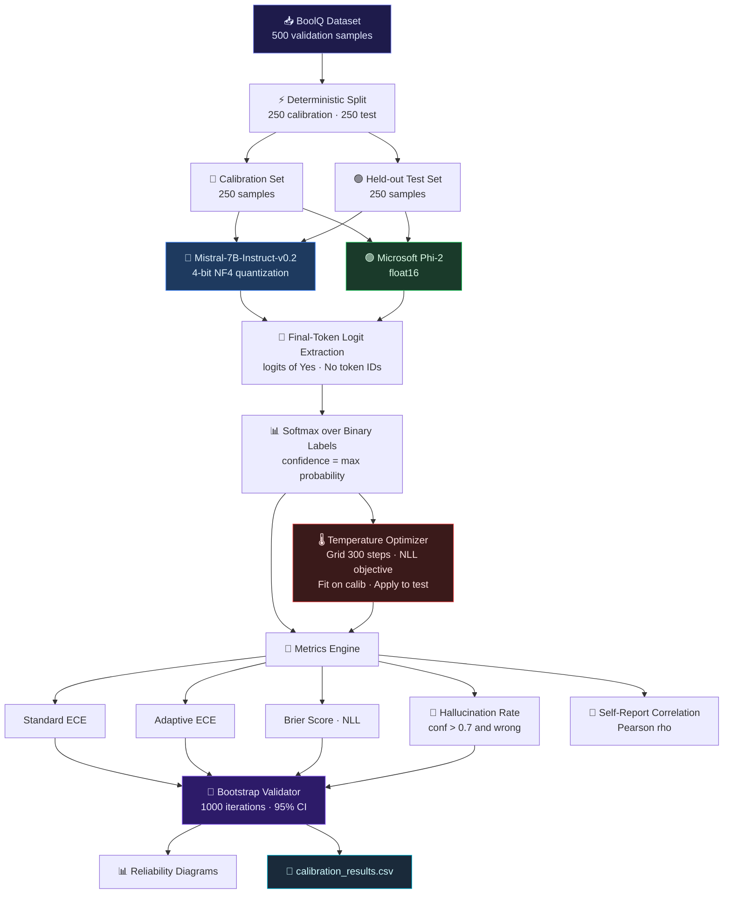
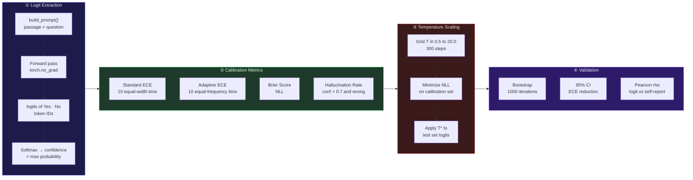
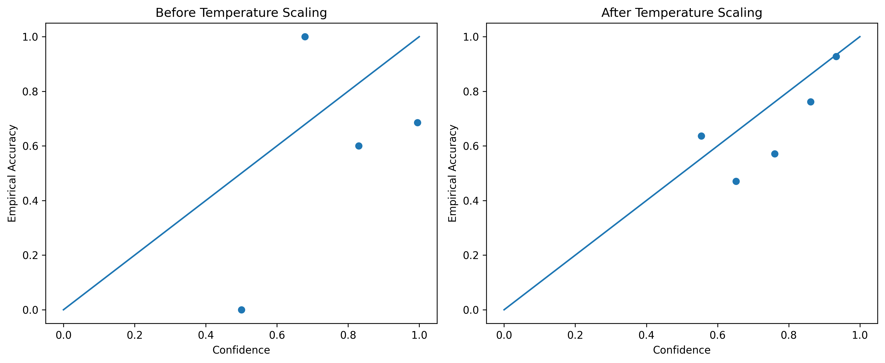

<div align="center"><b>LLM Confidence Calibration & Overconfidence Analysis</b></div> 

<div align="center">


<br/>

<br/>

<p>
  
  
  
  
</p>

<p>
  
  
  
  
</p>

<br/>

> **A production-grade statistical evaluation framework** for diagnosing and correcting overconfidence in instruction-tuned LLMs — via logit-level confidence extraction, ECE measurement, hallucination quantification, and post-hoc temperature scaling.  
> Designed for deployment-grade reliability without affecting model accuracy.

<br/>

 [🧠 Problem Statement](#-problem-statement) &nbsp;|&nbsp; [🏗️ Architecture](#️-system-architecture) &nbsp;|&nbsp; [⚙️ Methodology](#️-core-methodology) &nbsp;|&nbsp; [📁 Project Structure](#-project-structure) &nbsp;|&nbsp; [📊 Results](#-quantitative-results) &nbsp;|&nbsp; [🛠️ Tech Stack](#️-tech-stack) &nbsp;|&nbsp; [🚀 Getting Started](#-getting-started)
</div>

---


## 📋 Table of Contents

- [🧠 Problem Statement](#-problem-statement)
- [🎯 System Capabilities](#-system-capabilities)
- [🏗️ System Architecture](#-system-architecture)
- [⚙️ Core Methodology](#-core-methodology)
- [📁 Project Structure](#-project-structure)
- [🧪 Experimental Setup](#-experimental-setup)
- [📊 Quantitative Results](#-quantitative-results)
- [📈 Reliability Diagrams](#-reliability-diagrams)
- [💡 Key Insights](#-key-insights)
- [🔬 Research Extensions](#-research-extensions)
- [🚀 Getting Started](#-getting-started)
- [👩‍💻 Author](#-author)

---

## 🧠 Problem Statement

LLMs frequently produce **highly confident predictions — even when incorrect**.

In production environments, this creates compounding failure modes:

<table>
<tr>
<td align="center">🤖<br/><b>Overconfident<br/>Hallucinations</b></td>
<td align="center">⚠️<br/><b>Misleading<br/>Decision Support</b></td>
<td align="center">📈<br/><b>Risk Amplification<br/>in Enterprise AI</b></td>
<td align="center">🔍<br/><b>Reduced Trust<br/>in AI Outputs</b></td>
</tr>
</table>

This framework provides a **mathematically grounded** approach to measure, diagnose, and correct model miscalibration — without retraining.

---

## 🎯 System Capabilities

| Capability | Description |
|---|---|
| 🔢 **Logit-Level Extraction** | Final-token logits extracted over binary Yes/No label tokens |
| 📐 **Standard ECE** | Equal-width bin calibration error, `n_bins=10` |
| 📐 **Adaptive ECE** | Equal-frequency bins for robust low-data calibration |
| 🌡️ **Temperature Scaling** | Grid search over 300 T values ∈ [0.5, 20.0], minimizing NLL |
| 🔴 **Hallucination Detection** | Overconfident wrong-answer rate at threshold `conf > 0.7` |
| 🧬 **Bootstrap Validation** | 1000-iteration resampling with 95% CI for ECE reduction |
| 📊 **Reliability Diagrams** | Visual pre/post calibration alignment plots |
| 🔬 **Self-Report vs Logit** | Pearson ρ analysis of prompt-elicited vs logit-derived confidence |
| ⚖️ **Cross-Model Benchmarking** | Mistral-7B-Instruct vs Phi-2 calibration comparison |

---

## 🏗️ System Architecture



---

## ⚙️ Core Methodology

### Pipeline



### Temperature Scaling Formula

```
Raw Logits  →  Divide by T*  →  Softmax  →  Calibrated Probabilities

                     exp(z_i / T*)
    P_i(T*) =   ─────────────────────
                  Σ exp(z_j / T*)

Optimization:  T* = argmin  − Σ  y_i · log P_i(T)
                     T>0       i

  Mistral-7B  →  T* = 6.89   (extreme logit sharpness → large correction needed)
  Phi-2       →  T* = 1.35   (near-calibrated → minimal correction needed)
```

---

## 📁 Project Structure

```
LLM-Confidence-Calibration/
│
├── 📓 LLM_Calibration_Study.ipynb        # Complete end-to-end experiment
│
│   ├─ Environment Setup
│   │    └── GPU check · package installs · CUDA verification
│   │
│   ├─ Dataset Loading & Splitting
│   │    └── BoolQ (HuggingFace datasets) · 500 samples · 250/250 split
│   │
│   ├─ Mistral-7B-Instruct-v0.2 Setup
│   │    └── BitsAndBytesConfig · 4-bit NF4 · double quant · float16 compute
│   │
│   ├─ Core Functions
│   │    ├── build_prompt()           — passage + question prompt template
│   │    ├── get_yes_no_logits()      — final-token logit extraction
│   │    ├── collect_logits()         — batch inference over dataset split
│   │    ├── compute_ece()            — standard ECE, n_bins=10
│   │    └── optimize_temperature()   — grid search, 300 T values, NLL objective
│   │
│   ├─ Hallucination Analysis
│   │    └── Overconfident wrong predictions at threshold > 0.7
│   │
│   ├─ Post-Scaling Hallucination Rate
│   │    └── Before 18.4%  →  After 13.6%
│   │
│   ├─ Reliability Diagram Generation
│   │    └── reliability_data() · matplotlib · saved as PNG
│   │
│   ├─ Self-Report Confidence Extraction
│   │    └── model.generate() with structured output prompt
│   │
│   ├─ Pearson Correlation Analysis
│   │    └── scipy.stats.pearsonr · softmax vs self-reported (rho ≈ 0.10)
│   │
│   ├─ ECE Comparison: Softmax vs Self-Report
│   │    └── Standard ECE + filtered ECE (conf < 0.95)
│   │
│   ├─ Adaptive ECE
│   │    └── adaptive_ece() — equal-frequency binning
│   │
│   ├─ NLL Before / After
│   │    └── torch.nn.CrossEntropyLoss on raw vs scaled logits
│   │
│   ├─ Bootstrap Validation
│   │    └── 1000 iterations · np.percentile [2.5, 50, 97.5]
│   │
│   ├─ Phi-2 Evaluation
│   │    └── float16 · same pipeline · T* = 1.35 · ECE 0.0524 → 0.0322
│   │
│   └─ Export
│        └── calibration_results.csv · reliability_diagrams.png
│
├── 📊 reliability_diagrams.png            # Before / After reliability plots
├── 📄 calibration_results.csv            # softmax_conf · scaled_conf · correct · label
└── 📄 README.md
```

## 🛠️ Tech Stack

| Layer | Technology | Purpose |
|---|---|---|
| Language | Python 3.10 | Core implementation |
| Deep Learning | PyTorch 2.0+ | Model inference + logit extraction |
| Models | Mistral-7B-Instruct-v0.2, Phi-2 | LLM evaluation targets |
| Quantization | BitsAndBytes (4-bit NF4) | Memory-efficient model loading |
| Transformers | HuggingFace Transformers 4.38+ | Model + tokenizer loading |
| Dataset | HuggingFace Datasets (BoolQ) | Evaluation benchmark |
| Calibration | Custom ECE + Temperature Scaling | Core calibration engine |
| Statistics | SciPy, NumPy | Bootstrap validation + Pearson correlation |
| Data Processing | Pandas | Results export + analysis |
| Visualization | Matplotlib, Seaborn | Reliability diagrams |
| Environment | Google Colab (A100 GPU) | Experiment runtime |

---

## 🧪 Experimental Setup

| Property | Value |
|---|---|
| **Dataset** | BoolQ (Yes/No Question Answering) |
| **Total Samples** | 500 validation samples |
| **Calibration Split** | 250 samples — used to fit T* |
| **Test Split** | 250 samples — held-out, zero leakage |
| **Task Format** | Binary classification (Yes / No token logits) |
| **Confidence** | `softmax(logits[[no_id, yes_id]]).max()` |
| **Hallucination Threshold** | `conf > 0.7` on wrong predictions |
| **Temperature Grid** | T ∈ [0.5, 20.0], 300 linearly spaced values |
| **Bootstrap Iterations** | 1000, with replacement |
| **Runtime Environment** | Google Colab (GPU — A100 recommended) |

### Models

| Model | Parameters | Quantization | Loading |
|---|---|---|---|
| `mistralai/Mistral-7B-Instruct-v0.2` | 7B | 4-bit NF4, double quant, float16 compute | `device_map="auto"` |
| `microsoft/phi-2` | 2.7B | float16 | `device_map="auto"` |

---

## 📊 Quantitative Results

### 🔵 Mistral-7B-Instruct-v0.2

| Metric | Before Scaling | After Scaling |
|---|---|---|
| **Accuracy** | 81.2% | 81.2% ✅ |
| **Standard ECE** | 0.1588 | 0.0603 |
| **ECE Reduction** | — | **~62%** |
| **Optimal T*** | — | **6.89** |
| **Overconf. Hallucination Rate** | 18.4% | 13.6% |

> ⚠️ T* = 6.89 signals extreme logit sharpness — distributions are heavily peaked before correction.

### 🟢 Microsoft Phi-2

| Metric | Before Scaling | After Scaling |
|---|---|---|
| **Accuracy** | 80.0% | 80.0% ✅ |
| **Standard ECE** | 0.0524 | 0.0322 |
| **ECE Reduction** | — | **~39%** |
| **Optimal T*** | — | **1.35** |

> ✅ T* = 1.35 indicates Phi-2 is already near-calibrated — minimal correction required.

### Cross-Model Summary

```
╔══════════════════════════════════════════════════════════════════╗
║             CALIBRATION BENCHMARK — FINAL RESULTS               ║
╠══════════════════════════════════════════════════════════════════╣
║                                                                  ║
║   Model         │  ECE (raw)  │  ECE (cal)  │  T*   │  ΔECE    ║
║  ───────────────┼─────────────┼─────────────┼───────┼────────  ║
║   Mistral-7B    │   0.1588    │   0.0603    │  6.89 │  -62%    ║
║   Phi-2         │   0.0524    │   0.0322    │  1.35 │  -39%    ║
║                                                                  ║
║   Self-Report vs Logit Correlation (Mistral-7B): ρ ≈ 0.10      ║
║   → Prompt-elicited confidence is NOT a reliable estimator      ║
║                                                                  ║
╚══════════════════════════════════════════════════════════════════╝
```

---

## 📈 Reliability Diagrams

> Reliability diagrams plot **mean confidence vs. empirical accuracy** per bin.  
> Points on the diagonal = perfect calibration. Points below = overconfidence.



| Panel | Observation |
|---|---|
| **Before Temperature Scaling** | Points scattered well below the diagonal at high confidence — model severely overestimates its correctness |
| **After Temperature Scaling** | Points pulled back toward the diagonal — T* = 6.89 substantially redistributes probability mass, improving alignment |

---

## 💡 Key Insights

```
╔════════════════════════════════════════════════════════════════╗
║                    FINDINGS SUMMARY                            ║
╠════════════════════════════════════════════════════════════════╣
║                                                                ║
║  ①  Larger models are not better calibrated                    ║
║     Mistral-7B ECE 0.1588  >>  Phi-2 ECE 0.0524               ║
║                                                                ║
║  ②  Logit sharpness drives overconfidence                      ║
║     T* = 6.89 reveals extreme distribution peaking             ║
║                                                                ║
║  ③  Self-reported confidence is unreliable                     ║
║     Pearson rho ≈ 0.10 between softmax and prompt confidence   ║
║                                                                ║
║  ④  Temperature scaling is accuracy-neutral                    ║
║     Accuracy unchanged: 81.2% and 80.0% post-calibration       ║
║                                                                ║
║  ⑤  Hallucination risk is reducible without retraining         ║
║     Overconf. hallucination rate: 18.4% → 13.6% (Mistral-7B)  ║
║                                                                ║
╚════════════════════════════════════════════════════════════════╝
```

---

## 🔬 Research Extensions

| Extension | Description | Status |
|---|---|---|
| 🔄 **Dynamic Bin Calibration** | Adaptive binning per prediction region | 🔜 Planned |
| 🤐 **Selective Prediction** | Abstain when confidence < learned threshold | 🔜 Planned |
| 🧬 **Confidence-Aware Decoding** | Integrate T* directly into generation loop | 🔜 Planned |
| 📦 **Multi-Dataset Benchmarking** | TriviaQA, NaturalQuestions, HellaSwag | 🔜 Planned |
| 🌐 **Frontier Model Comparison** | GPT-4, Claude, Gemini calibration analysis | 🔜 Planned |

---

## 🚀 Getting Started

### Requirements

```bash
torch>=2.0
transformers>=4.38
datasets
bitsandbytes>=0.41
scikit-learn
matplotlib
seaborn
numpy
pandas
tqdm
scipy
accelerate
```

### Installation

```bash
# 1. Clone the repository
git clone https://github.com/debasmita30/LLM-Confidence-Calibration.git
cd LLM-Confidence-Calibration

# 2. Install dependencies
pip install -r requirements.txt

# 3. Open notebook
jupyter notebook LLM_Calibration_Study.ipynb
```

> 💡 **GPU required.** Mistral-7B uses ~6GB VRAM with 4-bit NF4 quantization. Phi-2 uses ~5GB at float16.  
> Notebook developed and tested on **Google Colab (A100)**.

### Run on Google Colab

[](https://colab.research.google.com/github/your-username/LLM-Confidence-Calibration/blob/main/LLM_Calibration_Study.ipynb)

---

## 🏭 Production Relevance

| Use Case | How This Applies |
|---|---|
| **Enterprise AI Systems** | Quantified reliability guarantees before production rollout |
| **Conversational AI** | Reduces misleading high-confidence wrong answers |
| **RLHF Diagnostics** | Flags reward model overconfidence during training |
| **Model Benchmarking** | Calibration as a first-class metric alongside accuracy |
| **Human-in-the-Loop AI** | Uncertainty scores inform when to escalate to human review |

---

## 👩‍💻 Author

<div align="center">


### Debasmita Chatterjee

*LLM Evaluation · Calibration Research · Applied AI Systems*


</div>

---

<div align="center">


<p><sub>
  Built to demonstrate that reliable AI requires more than accuracy —<br/>
  it requires <strong>calibrated, honest uncertainty</strong>.
</sub></p>

</div>
