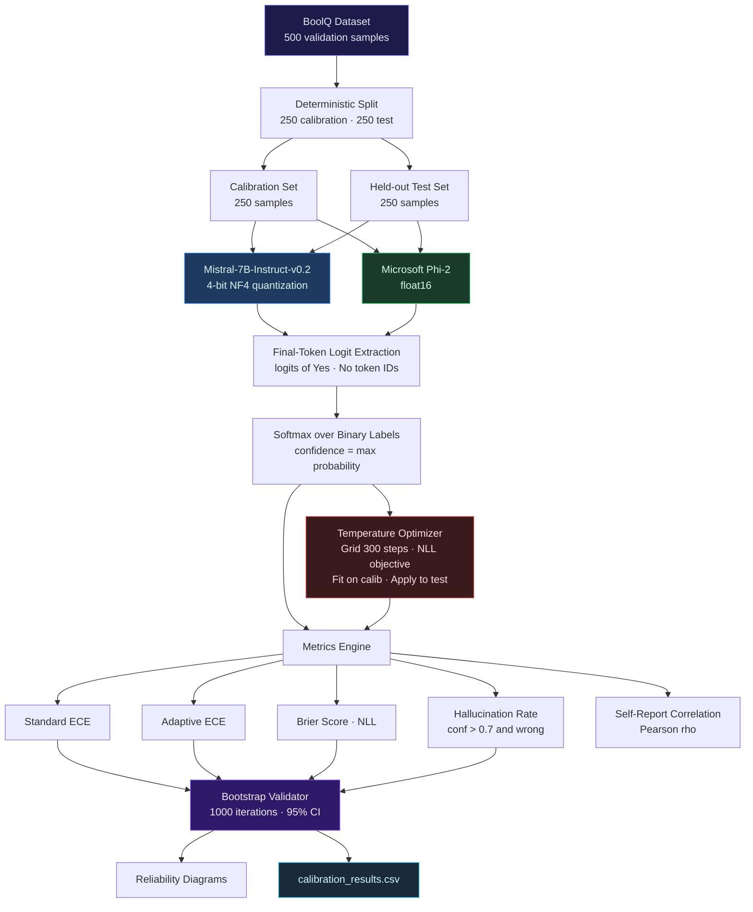
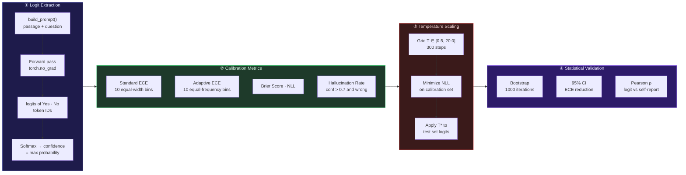

<div align="center">

# LLM Confidence Calibration & Overconfidence Analysis

### A Production-Grade Statistical Framework for Measuring, Diagnosing, and Correcting LLM Miscalibration

<p>
  
  
  
  
</p>

<p>
  
  
  
  
</p>

<br/>

> Instruction-tuned LLMs routinely assign high confidence to incorrect predictions — a failure mode with serious consequences in enterprise AI deployment. This framework provides a **mathematically rigorous, retraining-free** approach to quantify and correct that miscalibration using logit-level analysis, Expected Calibration Error (ECE) measurement, and post-hoc temperature scaling — validated via 1000-iteration bootstrap resampling.

<br/>

[](https://colab.research.google.com/github/debasmita30/LLM-Confidence-Calibration-Overconfidence-Analysis/blob/main/LLM_Calibration_Study.ipynb)
[](https://llm-confidence-calibration-overconfidence-analysis-ubbfcsmujjx.streamlit.app/)
</div>

---

## Table of Contents

- [Motivation](#motivation)
- [System Capabilities](#system-capabilities)
- [Architecture](#architecture)
- [Methodology](#methodology)
- [Project Structure](#project-structure)
- [Experimental Setup](#experimental-setup)
- [Results](#results)
- [Reliability Diagrams](#reliability-diagrams)
- [Key Findings](#key-findings)
- [Production Relevance](#production-relevance)
- [Tech Stack](#tech-stack)
- [Getting Started](#getting-started)

---

## Motivation

Accuracy alone is insufficient for deploying LLMs in high-stakes environments. A model that is 81% accurate but assigns 95%+ confidence to its wrong answers is **more dangerous than a model with lower accuracy that knows what it doesn't know**.

This project addresses four compounding failure modes in production LLM systems:

| Failure Mode | Impact |
|---|---|
| Overconfident hallucinations | Model states incorrect facts with certainty — users trust them |
| Misleading decision support | Downstream systems receive unreliable confidence signals |
| Risk amplification in enterprise AI | High-confidence errors propagate through pipelines unchecked |
| Eroded human-AI trust | No principled basis for knowing when to escalate to human review |

This framework diagnoses all four — and corrects the underlying miscalibration **without retraining**.

---

## System Capabilities

| Capability | Implementation |
|---|---|
| **Logit-level confidence extraction** | Final-token logits extracted over binary Yes/No label token IDs |
| **Standard ECE** | Equal-width binning, `n_bins=10` |
| **Adaptive ECE** | Equal-frequency binning for robust low-data calibration |
| **Temperature scaling** | Grid search over 300 T values ∈ [0.5, 20.0], NLL minimization |
| **Hallucination quantification** | Overconfident wrong-answer rate at threshold `conf > 0.7` |
| **Bootstrap validation** | 1000-iteration resampling with 95% confidence intervals |
| **Reliability diagrams** | Pre/post calibration visual alignment plots |
| **Self-report vs logit analysis** | Pearson ρ between prompt-elicited and logit-derived confidence |
| **Cross-model benchmarking** | Mistral-7B-Instruct-v0.2 vs Microsoft Phi-2 |

---

## Architecture



---

## Methodology

### Four-Stage Pipeline



### Temperature Scaling

Temperature scaling is a post-hoc calibration method that divides raw logits by a scalar T* before applying softmax. Critically, it does not alter model weights or affect accuracy — it only reshapes the confidence distribution.

```
Raw Logits  →  Divide by T*  →  Softmax  →  Calibrated Probabilities

                     exp(z_i / T*)
    P_i(T*) =   ─────────────────────
                  Σ exp(z_j / T*)

Optimization:  T* = argmin  − Σ  y_i · log P_i(T)
                     T>0       i

  Mistral-7B  →  T* = 6.89   (extreme logit sharpness → large correction needed)
  Phi-2       →  T* = 1.35   (near-calibrated → minimal correction needed)
```

T* is fit exclusively on the calibration split and applied to the held-out test set, ensuring zero data leakage.

---

## Project Structure

```
LLM-Confidence-Calibration/
│
├── LLM_Calibration_Study.ipynb           # Complete end-to-end experiment
│
│   ├─ Environment Setup
│   │    └── GPU check · package installs · CUDA verification
│   │
│   ├─ Dataset Loading & Splitting
│   │    └── BoolQ (HuggingFace datasets) · 500 samples · 250/250 split
│   │
│   ├─ Mistral-7B-Instruct-v0.2 Setup
│   │    └── BitsAndBytesConfig · 4-bit NF4 · double quant · float16 compute
│   │
│   ├─ Core Functions
│   │    ├── build_prompt()           — passage + question prompt template
│   │    ├── get_yes_no_logits()      — final-token logit extraction
│   │    ├── collect_logits()         — batch inference over dataset split
│   │    ├── compute_ece()            — standard ECE, n_bins=10
│   │    └── optimize_temperature()   — grid search, 300 T values, NLL objective
│   │
│   ├─ Hallucination Analysis
│   │    └── Overconfident wrong predictions at threshold conf > 0.7
│   │
│   ├─ Post-Scaling Hallucination Rate
│   │    └── Before 18.4%  →  After 13.6%
│   │
│   ├─ Reliability Diagram Generation
│   │    └── reliability_data() · matplotlib · saved as PNG
│   │
│   ├─ Self-Report Confidence Extraction
│   │    └── model.generate() with structured output prompt
│   │
│   ├─ Pearson Correlation Analysis
│   │    └── scipy.stats.pearsonr · softmax vs self-reported (rho ≈ 0.10)
│   │
│   ├─ ECE Comparison: Softmax vs Self-Report
│   │    └── Standard ECE + filtered ECE (conf < 0.95)
│   │
│   ├─ Adaptive ECE
│   │    └── adaptive_ece() — equal-frequency binning
│   │
│   ├─ NLL Before / After
│   │    └── torch.nn.CrossEntropyLoss on raw vs scaled logits
│   │
│   ├─ Bootstrap Validation
│   │    └── 1000 iterations · np.percentile [2.5, 50, 97.5]
│   │
│   ├─ Phi-2 Evaluation
│   │    └── float16 · same pipeline · T* = 1.35 · ECE 0.0524 → 0.0322
│   │
│   └─ Export
│        └── calibration_results.csv · reliability_diagrams.png
│
├── reliability_diagrams.png              # Before/after reliability plots
├── calibration_results.csv              # softmax_conf · scaled_conf · correct · label
└── README.md
```

---

## Experimental Setup

| Property | Value |
|---|---|
| **Dataset** | BoolQ — binary Yes/No question answering |
| **Total samples** | 500 validation samples |
| **Calibration split** | 250 samples — used exclusively to fit T* |
| **Test split** | 250 samples — held-out, zero leakage |
| **Task format** | Binary classification via Yes/No token logits |
| **Confidence definition** | `softmax(logits[[no_id, yes_id]]).max()` |
| **Hallucination threshold** | `conf > 0.7` on incorrect predictions |
| **Temperature grid** | T ∈ [0.5, 20.0], 300 linearly spaced steps |
| **Bootstrap iterations** | 1000, with replacement |
| **Runtime** | Google Colab (A100 GPU) |

### Models Evaluated

| Model | Parameters | Quantization | Memory |
|---|---|---|---|
| `mistralai/Mistral-7B-Instruct-v0.2` | 7B | 4-bit NF4, double quant, float16 compute | ~6GB VRAM |
| `microsoft/phi-2` | 2.7B | float16 | ~5GB VRAM |

---

## Results

### Mistral-7B-Instruct-v0.2

| Metric | Before Scaling | After Scaling | Change |
|---|---|---|---|
| **Accuracy** | 81.2% | 81.2% | No change ✅ |
| **Standard ECE** | 0.1588 | 0.0603 | −62% |
| **Optimal T\*** | — | 6.89 | — |
| **Hallucination Rate** | 18.4% | 13.6% | −4.8pp |

> T* = 6.89 indicates extreme logit sharpness — the model's probability distributions were heavily peaked at high confidence before correction.

### Microsoft Phi-2

| Metric | Before Scaling | After Scaling | Change |
|---|---|---|---|
| **Accuracy** | 80.0% | 80.0% | No change ✅ |
| **Standard ECE** | 0.0524 | 0.0322 | −39% |
| **Optimal T\*** | — | 1.35 | — |

> T* = 1.35 indicates Phi-2 is nearly calibrated out of the box — a notable result given it is a significantly smaller model.

### Cross-Model Calibration Summary

```
╔══════════════════════════════════════════════════════════════════╗
║              CALIBRATION BENCHMARK — FINAL RESULTS              ║
╠══════════════════════════════════════════════════════════════════╣
║                                                                  ║
║   Model         │  ECE (raw)  │  ECE (cal)  │  T*   │  ΔECE    ║
║  ───────────────┼─────────────┼─────────────┼───────┼────────  ║
║   Mistral-7B    │   0.1588    │   0.0603    │  6.89 │  -62%    ║
║   Phi-2         │   0.0524    │   0.0322    │  1.35 │  -39%    ║
║                                                                  ║
║   Self-Report vs Logit Correlation (Mistral-7B): ρ ≈ 0.10      ║
║   → Prompt-elicited confidence is NOT a reliable estimator      ║
║                                                                  ║
╚══════════════════════════════════════════════════════════════════╝
```

---

## Reliability Diagrams

Reliability diagrams plot mean predicted confidence against empirical accuracy per bin. A perfectly calibrated model would lie on the diagonal. Points below the diagonal indicate overconfidence — the model's stated certainty exceeds its actual accuracy.


| Panel | Observation |
|---|---|
| **Before temperature scaling** | Points scatter significantly below the diagonal at high confidence — the model severely overestimates its correctness |
| **After temperature scaling** | Points align toward the diagonal — T* = 6.89 substantially redistributes probability mass and improves calibration alignment |

---

## Key Findings

```
╔════════════════════════════════════════════════════════════════╗
║                     FINDINGS SUMMARY                           ║
╠════════════════════════════════════════════════════════════════╣
║                                                                ║
║  ①  Model size does not predict calibration quality            ║
║     Mistral-7B ECE 0.1588  >>  Phi-2 ECE 0.0524               ║
║     Smaller model is better calibrated by a wide margin        ║
║                                                                ║
║  ②  Logit sharpness is the primary driver of overconfidence    ║
║     T* = 6.89 reveals extreme distribution peaking in Mistral  ║
║                                                                ║
║  ③  Prompt-elicited confidence is not a reliable signal        ║
║     Pearson ρ ≈ 0.10 between softmax and self-reported conf    ║
║     → Do not use model self-reports as uncertainty estimates   ║
║                                                                ║
║  ④  Temperature scaling is accuracy-neutral                    ║
║     Accuracy unchanged at 81.2% and 80.0% post-calibration     ║
║                                                                ║
║  ⑤  Hallucination risk is reducible without retraining         ║
║     Overconfident hallucination rate: 18.4% → 13.6%            ║
║                                                                ║
╚════════════════════════════════════════════════════════════════╝
```

---

## Production Relevance

This framework directly addresses challenges encountered when deploying LLMs in enterprise environments:

| Use Case | Application |
|---|---|
| **Enterprise AI deployment** | Provides quantified reliability guarantees before production rollout |
| **Conversational AI** | Reduces the rate of misleading high-confidence wrong answers surfaced to users |
| **RLHF diagnostics** | Flags reward model overconfidence during training pipelines |
| **Model selection & benchmarking** | Establishes calibration as a first-class evaluation metric alongside accuracy |
| **Human-in-the-loop systems** | Calibrated confidence scores provide principled thresholds for escalation to human review |
| **Financial & regulated domains** | Uncertainty quantification is a compliance requirement in risk-sensitive AI applications |

---

## Tech Stack

| Layer | Technology | Role |
|---|---|---|
| Language | Python 3.10 | Core implementation |
| Deep learning | PyTorch 2.0+ | Model inference and logit extraction |
| Models | Mistral-7B-Instruct-v0.2, Phi-2 | LLM evaluation targets |
| Quantization | BitsAndBytes (4-bit NF4) | Memory-efficient model loading |
| Transformers | HuggingFace Transformers 4.38+ | Model and tokenizer loading |
| Dataset | HuggingFace Datasets (BoolQ) | Evaluation benchmark |
| Calibration | Custom ECE + temperature scaling | Core calibration engine |
| Statistics | SciPy, NumPy | Bootstrap validation and Pearson correlation |
| Data processing | Pandas | Results export and analysis |
| Visualization | Matplotlib, Seaborn | Reliability diagrams |
| Runtime | Google Colab (A100 GPU) | Experiment environment |

---

## Getting Started

### Requirements

```
torch>=2.0
transformers>=4.38
datasets
bitsandbytes>=0.41
scikit-learn
matplotlib
seaborn
numpy
pandas
tqdm
scipy
accelerate
```

### Installation

```bash
git clone https://github.com/debasmita30/LLM-Confidence-Calibration-Overconfidence-Analysis.git
cd LLM-Confidence-Calibration-Overconfidence-Analysis
pip install -r requirements.txt
jupyter notebook LLM_Calibration_Study.ipynb
```

> GPU required. Mistral-7B uses approximately 6GB VRAM with 4-bit NF4 quantization. Phi-2 uses approximately 5GB at float16. The notebook was developed and tested on Google Colab with an A100 GPU.

### Run on Google Colab

[](https://colab.research.google.com/github/debasmita30/LLM-Confidence-Calibration-Overconfidence-Analysis/blob/main/LLM_Calibration_Study.ipynb)

---

## Research Extensions

| Extension | Description |
|---|---|
| Dynamic bin calibration | Adaptive binning per prediction region for non-uniform confidence distributions |
| Selective prediction | Abstain mechanism when confidence falls below a learned threshold |
| Confidence-aware decoding | Integrate T* directly into the generation loop at inference time |
| Multi-dataset benchmarking | Extend evaluation to TriviaQA, NaturalQuestions, HellaSwag |
| Frontier model comparison | Calibration analysis for GPT-4, Claude, and Gemini via API |

---

## Author

<div align="center">

**Debasmita Chatterjee**

LLM Evaluation · Calibration Research · Applied AI Systems

[](https://www.linkedin.com/in/debasmita-chatterjee/)
[](https://github.com/debasmita30)
[](https://leafy-cajeta-9270ea.netlify.app/)

</div>

---

<div align="center">
<sub>
Reliable AI requires more than accuracy — it requires calibrated, honest uncertainty.
</sub>
</div>
