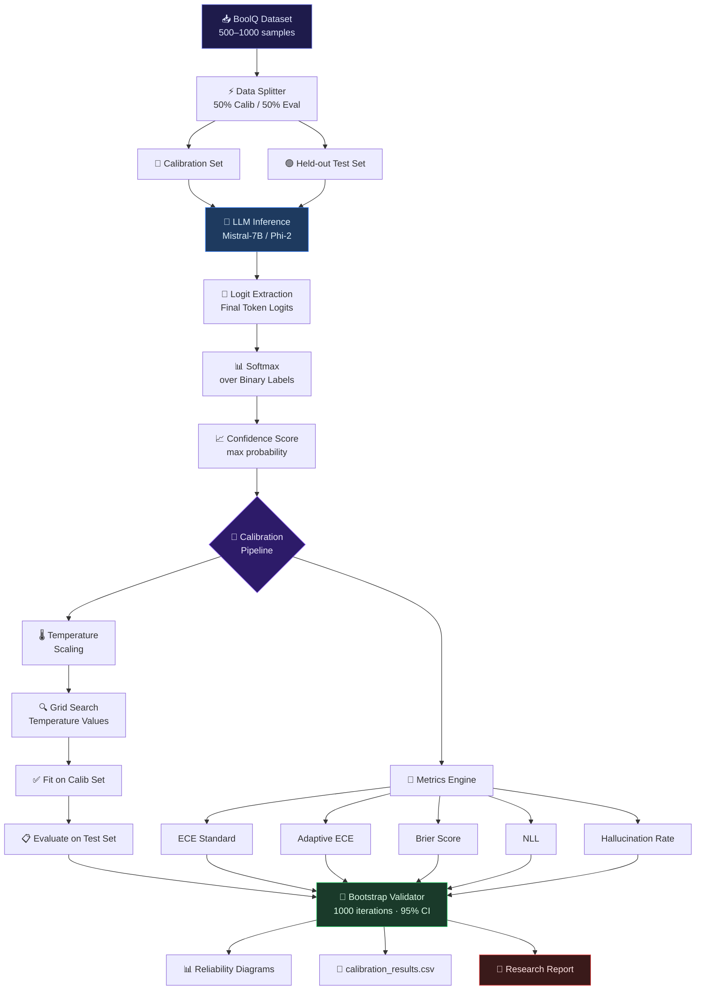
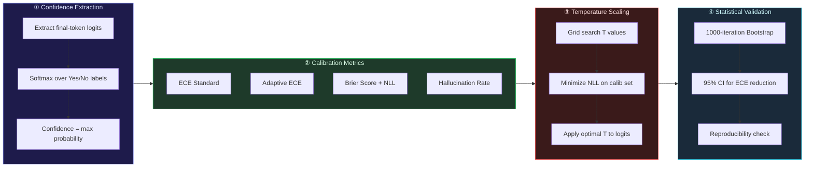

<div align="center">


<br/>

<p>
  
  
  
  
  
</p>

<p>
  
  
  
  
</p>

<br/>

> **A production-grade statistical framework** for diagnosing and correcting overconfidence in instruction-tuned LLMs —
> via logit-level confidence extraction, ECE measurement, hallucination quantification, and post-hoc temperature scaling.
> Designed for deployment-grade reliability without affecting model accuracy.

<br/>

</div>

---

## 📋 Table of Contents

- [🧠 Problem Statement](#-problem-statement)
- [🎯 System Capabilities](#-system-capabilities)
- [🏗️ System Architecture](#-system-architecture)
- [⚙️ Core Methodology](#-core-methodology)
- [📁 Project Structure](#-project-structure)
- [🧪 Experimental Setup](#-experimental-setup)
- [📊 Quantitative Results](#-quantitative-results)
- [💡 Key Insights](#-key-insights)
- [📈 Reliability Diagnostics](#-reliability-diagnostics)
- [🔬 Research Extensions](#-research-extensions)
- [🚀 Getting Started](#-getting-started)
- [👩‍💻 Author](#-author)

---

## 🧠 Problem Statement

LLMs frequently produce **highly confident predictions — even when incorrect**.

In production environments, this creates compounding failure modes:

<table>
<tr>
<td align="center">🤖<br/><b>Overconfident<br/>Hallucinations</b></td>
<td align="center">⚠️<br/><b>Misleading<br/>Decision Support</b></td>
<td align="center">📈<br/><b>Risk Amplification<br/>in Enterprise AI</b></td>
<td align="center">🔍<br/><b>Reduced Trust<br/>in AI Outputs</b></td>
</tr>
</table>

This framework provides a **mathematically grounded** approach to measure, diagnose, and correct model miscalibration — without retraining.

---

## 🎯 System Capabilities

| Capability | Description |
|---|---|
| 🔢 **Logit-Level Extraction** | Direct confidence extraction from model internals |
| 📐 **ECE Measurement** | Standard + Adaptive Expected Calibration Error |
| 🌡️ **Temperature Scaling** | Post-hoc probabilistic correction via grid search |
| 🧬 **Bootstrap Validation** | 1000-iteration resampling with 95% CI |
| 🔴 **Hallucination Detection** | Overconfident wrong-answer rate quantification |
| 📊 **Reliability Diagrams** | Visual calibration alignment analysis |
| ⚖️ **Cross-Model Benchmarking** | Comparative calibration across model families |

---

## 🏗️ System Architecture



---

## ⚙️ Core Methodology

### Pipeline Overview



### Temperature Scaling — How It Works

```
Raw Logits  →  Divide by T  →  Softmax  →  Calibrated Probabilities

         z_i                         exp(z_i / T)
P_i  =  ─────   becomes   P_i(T)  =  ─────────────────
         softmax                       Σ exp(z_j / T)

  T > 1  →  softer distribution  →  reduces overconfidence
  T < 1  →  sharper distribution →  increases confidence
  T = 1  →  no change (baseline)
```

Optimization objective:

```
T* = argmin  − Σ  y_i · log P_i(T)
       T>0       i
```

---

## 📁 Project Structure

```
LLM-Confidence-Calibration/
│
├── 📓 LLM_Calibration_Study.ipynb      # End-to-end experimental notebook
│
├── 📂 data/
│   ├── 📄 boolq_sample.jsonl           # BoolQ validation subset (500–1000 samples)
│   └── 📄 split_config.json            # Calibration / test split configuration
│
├── 📂 extraction/
│   ├── 📄 logit_extractor.py           # Final-token logit extraction pipeline
│   ├── 📄 softmax_confidence.py        # Softmax over binary label tokens
│   └── 📄 label_mapper.py             # Yes/No token ID mapping per model
│
├── 📂 calibration/
│   ├── 📄 ece_standard.py             # Equal-width bin ECE computation
│   ├── 📄 ece_adaptive.py             # Equal-frequency adaptive ECE
│   ├── 📄 brier_nll.py               # Brier score + Negative Log Likelihood
│   └── 📄 hallucination_rate.py      # Overconfident wrong-answer detection
│
├── 📂 temperature_scaling/
│   ├── 📄 grid_search.py             # Temperature grid search optimizer
│   ├── 📄 nll_minimizer.py           # NLL objective function
│   └── 📄 apply_scaling.py          # Apply T* to held-out test set
│
├── 📂 validation/
│   ├── 📄 bootstrap.py              # 1000-iteration bootstrap resampler
│   └── 📄 confidence_intervals.py  # 95% CI computation for ECE reduction
│
├── 📂 visualization/
│   ├── 📄 reliability_diagram.py    # Pre/post calibration reliability plots
│   ├── 📄 confidence_histogram.py  # Confidence score distributions
│   └── 📄 ece_comparison.py        # Cross-model calibration bar charts
│
├── 📄 calibration_results.csv       # Full quantitative results export
└── 📄 README.md
```

---

## 🧪 Experimental Setup

### Dataset

| Property | Value |
|---|---|
| **Dataset** | BoolQ (Yes/No Question Answering) |
| **Sample Size** | 500 – 1000 validation samples |
| **Calibration Split** | 50% (used to fit temperature) |
| **Evaluation Split** | 50% held-out (zero leakage) |
| **Task Format** | Binary classification (Yes / No) |

### Models Evaluated

| Model | Type | Quantization |
|---|---|---|
| `mistralai/Mistral-7B-Instruct-v0.2` | Instruction-tuned, 7B params | 4-bit (bitsandbytes) |
| `microsoft/phi-2` | Instruction-tuned, 2.7B params | Full precision |

---

## 📊 Quantitative Results

### 🔵 Mistral-7B-Instruct-v0.2

```
┌─────────────────────────────────────────────────────┐
│  Accuracy              │  81.2%                      │
│  Raw ECE               │  0.1588   ████████░░░░░░░░  │
│  Calibrated ECE        │  0.0603   ███░░░░░░░░░░░░░  │
│  ECE Reduction         │  ~62%  ✅                   │
│  Optimal Temperature   │  T* = 6.89  (high sharpness)│
│  Hallucination Rate    │  18.4%  →  13.6%  (before/after) │
└─────────────────────────────────────────────────────┘
  Observation: Extreme logit sharpness → strong overconfidence
               Temperature scaling provides major correction
```

### 🟢 Phi-2

```
┌─────────────────────────────────────────────────────┐
│  Accuracy              │  80.0%                      │
│  Raw ECE               │  0.0524   ██░░░░░░░░░░░░░░  │
│  Calibrated ECE        │  0.0322   █░░░░░░░░░░░░░░░  │
│  ECE Reduction         │  ~39%  ✅                   │
│  Optimal Temperature   │  T* = 1.35  (near-calibrated)│
└─────────────────────────────────────────────────────┘
  Observation: Smaller model shows stronger inherent calibration
               Minimal temperature correction required
```

### Side-by-Side Comparison

| Metric | Mistral-7B (Raw) | Mistral-7B (Calibrated) | Phi-2 (Raw) | Phi-2 (Calibrated) |
|---|---|---|---|---|
| **Accuracy** | 81.2% | 81.2% ✅ | 80.0% | 80.0% ✅ |
| **ECE** | 0.1588 | 0.0603 | 0.0524 | 0.0322 |
| **Halluc. Rate** | 18.4% | 13.6% | — | — |
| **Optimal T*** | — | 6.89 | — | 1.35 |
| **ECE Reduction** | — | **~62%** | — | **~39%** |

> ✅ Temperature scaling improves calibration without altering accuracy in both models.

---

## 💡 Key Insights

```
╔════════════════════════════════════════════════════════════════╗
║                    FINDINGS SUMMARY                            ║
╠════════════════════════════════════════════════════════════════╣
║                                                                ║
║  ①  Larger models ≠ better calibrated                         ║
║     Mistral-7B (7B) is less calibrated than Phi-2 (2.7B)      ║
║                                                                ║
║  ②  Logit sharpness drives overconfidence                      ║
║     High T* (6.89) indicates extreme distribution peaking      ║
║                                                                ║
║  ③  Self-reported confidence is unreliable                     ║
║     Prompt-based confidence correlates weakly (ρ ≈ 0.10)      ║
║                                                                ║
║  ④  Temperature scaling is accuracy-neutral                    ║
║     Calibration improves without any accuracy degradation      ║
║                                                                ║
║  ⑤  Prompt-based uncertainty ≠ valid estimator                 ║
║     Logit-level extraction is the reliable alternative         ║
║                                                                ║
╚════════════════════════════════════════════════════════════════╝
```

---

## 📈 Reliability Diagnostics

Reliability diagrams plot **mean confidence vs. actual accuracy** per bin.

```
Ideal Calibration            Overconfident Model          Post-Scaling
─────────────────            ───────────────────          ────────────
Accuracy                     Accuracy                     Accuracy
  1.0 │          ╱             1.0 │    ·····╱              1.0 │        ╱·
      │        ╱                   │  ·····╱                    │      ╱·
  0.5 │      ╱                 0.5 │·····╱                  0.5 │    ╱·
      │    ╱                       │·····                       │  ╱·
  0.0 └──────────               0.0 └──────────             0.0 └──────────
       0.0     1.0                   0.0     1.0                  0.0     1.0
       Confidence                    Confidence                   Confidence

  Points on diagonal           Points below diagonal        Points near diagonal
  = perfect calibration        = overconfidence             = corrected by T*
```

---

## 🔬 Research Extensions

| Extension | Description | Status |
|---|---|---|
| 🔄 **Dynamic Bin Calibration** | Adaptive binning per prediction region | 🔜 Planned |
| 🤐 **Selective Prediction** | Abstention when confidence < threshold | 🔜 Planned |
| 🧬 **Confidence-Aware Decoding** | Integrate calibration into generation loop | 🔜 Planned |
| 📦 **Multi-Dataset Benchmarking** | TriviaQA, NQ, HellaSwag extensions | 🔜 Planned |
| 🌐 **Frontier Model Comparison** | GPT-4, Claude, Gemini calibration analysis | 🔜 Planned |

---

## 🚀 Getting Started

### Prerequisites

```bash
python >= 3.10
torch >= 2.0
transformers >= 4.38
bitsandbytes >= 0.41    # for 4-bit quantization
datasets
numpy
pandas
matplotlib
scipy
```

### Installation

```bash
# 1. Clone the repository
git clone https://github.com/your-username/LLM-Confidence-Calibration.git
cd LLM-Confidence-Calibration

# 2. Create virtual environment
python -m venv venv
source venv/bin/activate   # Windows: venv\Scripts\activate

# 3. Install dependencies
pip install -r requirements.txt
```

### Run the Notebook

```bash
jupyter notebook LLM_Calibration_Study.ipynb
```

> 💡 **GPU recommended** — Mistral-7B requires ~6GB VRAM with 4-bit quantization. Phi-2 runs on ~5GB.

### Quick Start — Run Calibration Only

```python
from calibration.ece_standard import compute_ece
from temperature_scaling.grid_search import find_optimal_temperature

# Compute raw ECE
ece = compute_ece(confidences, labels, n_bins=10)

# Find optimal temperature on calibration set
T_star = find_optimal_temperature(logits_calib, labels_calib)

# Apply to test set and re-evaluate
ece_calibrated = compute_ece(apply_temperature(logits_test, T_star), labels_test)
```

---

## 🏭 Production Relevance

This framework directly addresses real deployment requirements:

| Use Case | How This Applies |
|---|---|
| **Enterprise AI Systems** | Quantified reliability guarantees before production rollout |
| **Conversational AI** | Reduces misleading confident wrong answers |
| **RLHF Diagnostics** | Flags reward model overconfidence during training |
| **Model Benchmarking** | Calibration as a first-class evaluation metric |
| **Human-in-the-Loop AI** | Uncertainty scores inform when to escalate to humans |

---

## 👩‍💻 Author

<div align="center">


### Debasmita Chatterjee

*LLM Evaluation · Calibration Research · Applied AI Systems*

<p>
  <a href="https://linkedin.com/in/your-profile">
    
  </a>
  <a href="https://github.com/your-username">
    
  </a>
</p>

</div>

---

<div align="center">


<p><sub>
  Built to demonstrate that reliable AI requires more than accuracy —<br/>
  it requires <strong>calibrated, honest uncertainty</strong>.
</sub></p>

</div>
